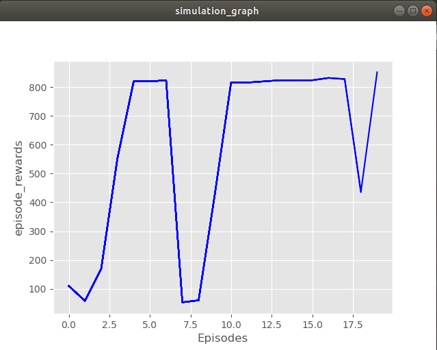

# Reinforcement Learning on a custom car using ROS

Package which trains the robot to travel through a maze without hiting the wall autonomously using Reinforcement Learning.

## Install dependencies

```bash
sudo pip install gym
sudo apt-get install python-skimage
sudo pip install h5py
pip install tensorflow-gpu (if you have a gpu if not then just pip install tensorflow)
sudo pip install keras
cd ~
git clone https://github.com/erlerobot/gym-gazebo
cd gym-gazebo
sudo pip install -e .
```
## Clone this repository

```bash
cd catkin_ws/src
git clone "https://github.com/YugAjmera/rl-car-ros.git"
cd ..
catkin_make
```

## Launch

```bash
roslaunch rl-car-ros simple.launch
roslaunch rl-car-ros start_qlearning.launch
```




Qlearning Graph obtained at 20 episodes, 500 steps with alpha = 0.1, Gamma = 0.8 and epsilon = 0.9.
