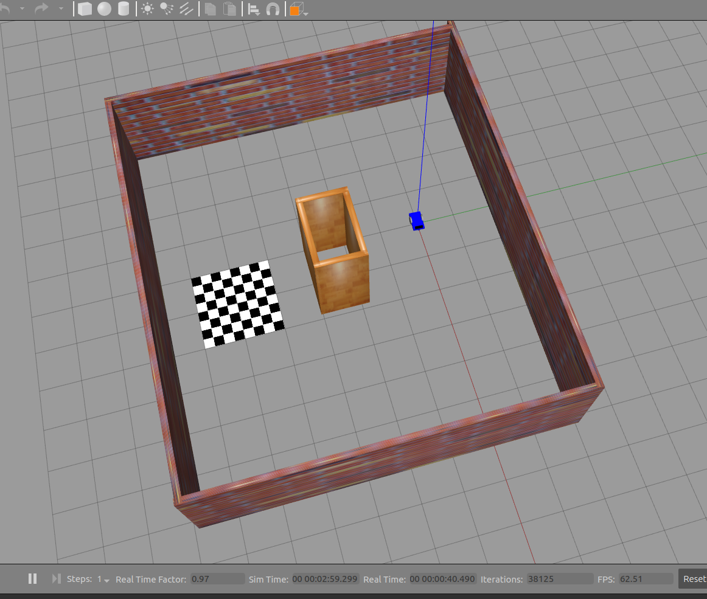
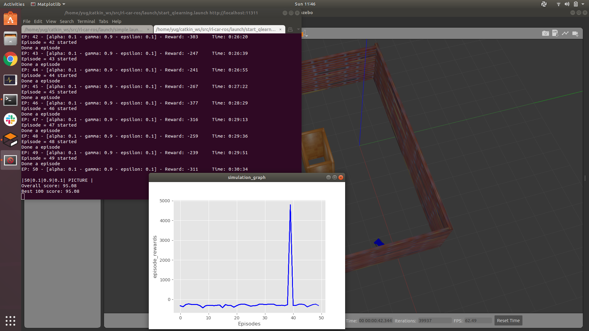
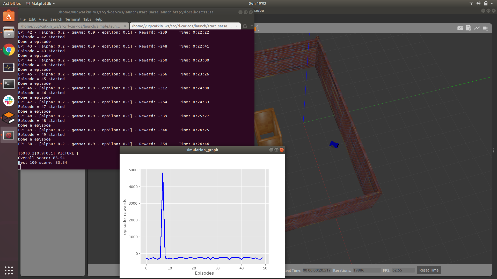
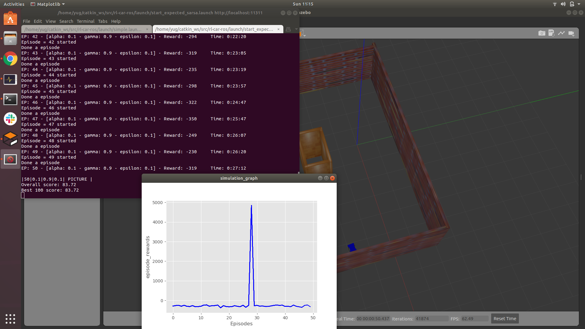

# Reinforcement Learning on a custom car using ROS

Package which trains a robot to reach a goal position without colliding using RL. Experiments are carried out on a car simulation in Gazebo.


## Install dependencies

```bash
sudo pip install gym
sudo apt-get install python-skimage
sudo pip install h5py
pip install tensorflow-gpu (if you have a gpu if not then just pip install tensorflow)
sudo pip install keras
cd ~
git clone https://github.com/erlerobot/gym-gazebo
cd gym-gazebo
sudo pip install -e .
```
## Clone this repository

```bash
cd catkin_ws/src
git clone "https://github.com/YugAjmera/rl-car-ros.git"
cd ..
catkin_make
```

## Launch

```bash
roslaunch rl-car-ros simple.launch
```
- Start  Q-Learning agent with 𝜖 -greedy action selection : 
```
roslaunch rl-car-ros start_qlearning.launch
```
or
- Start Sarsa-Learning agent with 𝜖 -greedy action selection : 
```
roslaunch rl-car-ros start_sarsa.launch 
```
or
- Start Expected Sarsa-Learning agent with 𝜖 -greedy action selection :
```
roslaunch rl-car-ros start_expected_sarsa.launch 
```


## Environment Specifications

- State : LaserScan + Odometry(x and y coordinates)
- Actions : Forward, Right, Left
- Episodic Task: An episode ends when the robot hits a wall (Reward = -200) or when the robot reaches the goal position (Reward = +5000). A living reward of -1 is given at each step which encourages the robot to end the episode as soon as possible.
- The world is show below:



- Below are the results obtained for 50 episodes: (if someone could run this for 1000 episodes, I would be happy to accept a pull request !)




